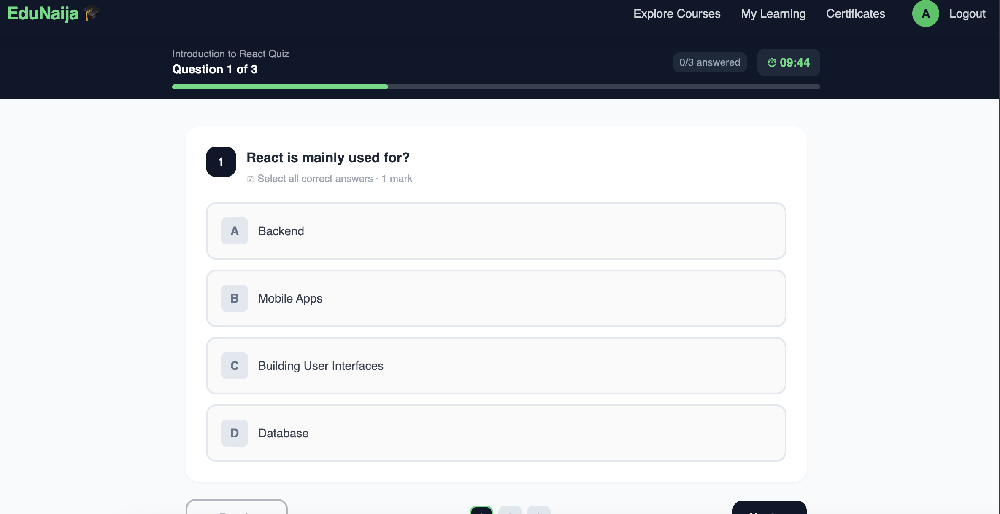
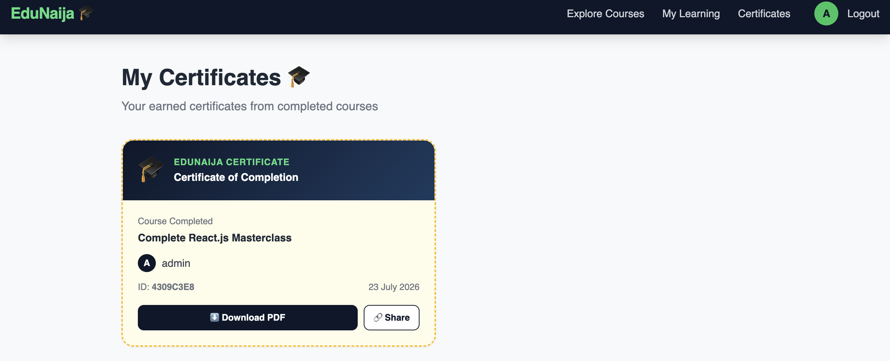

# 🎓 EduNaija — Nigerian Learning Management System

> A full-stack Learning Management System built for the Nigerian market, where students learn, instructors teach, and knowledge grows.

[](https://edunaija-kohl.vercel.app)
[](https://www.djangoproject.com/)
[](https://react.dev/)
[](https://paystack.com/)

**🔗 Live Demo:** [edunaija-kohl.vercel.app](https://edunaija-kohl.vercel.app)  
**🔗 API:** [edunaija-backend-7b22.onrender.com/api/v1](https://edunaija-backend-7b22.onrender.com/api/v1)

---

## 📖 About

EduNaija is a production-ready Learning Management System built to demonstrate advanced full-stack development skills. It features role-based authentication, a custom quiz engine with auto-grading, PDF certificate generation, Paystack payment integration, and real-time progress tracking — all wrapped in a clean, mobile-responsive design.

Built as a portfolio project to showcase backend complexity, algorithm design, and full deployment pipelines.

---

## 🚀 Features

### 👨‍🎓 Students

- Register and login with JWT authentication
- Browse and search courses by category and level
- Enroll in free courses or pay for premium ones via Paystack
- Watch video lessons and read text content
- Mark lessons as complete with real-time progress tracking
- Take auto-graded quizzes with instant feedback
- Retake quizzes until passing the cut-off mark
- Earn and download PDF certificates on course completion
- Write reviews and rate courses
- View personal dashboard with enrolled courses and progress

### 👨‍🏫 Instructors

- Register as an instructor
- Create and manage courses with sections and lessons
- Set course pricing (free or paid)
- View analytics — enrollments, revenue, and ratings
- Manage course content through admin panel

### ⚙️ Backend Features

- Custom User model with role-based access (Student/Instructor/Admin)
- Quiz engine with 3 question types: Single Choice, Multiple Choice, True/False
- Partial marking algorithm for multiple choice questions
- Automatic course completion detection
- PDF certificate generation using ReportLab
- Unique certificate verification system (public URL)
- Paystack payment initialization and verification
- Cloudinary media storage for course thumbnails
- JWT authentication with token refresh and blacklist

---

## 🛠️ Tech Stack

| Layer              | Technology                           |
| ------------------ | ------------------------------------ |
| **Backend**        | Django 5.2 + Django REST Framework   |
| **Frontend**       | React 18 + Vite + Tailwind CSS       |
| **Database**       | PostgreSQL (Neon)                    |
| **Auth**           | JWT (djangorestframework-simplejwt)  |
| **Payments**       | Paystack                             |
| **Media Storage**  | Cloudinary                           |
| **PDF Generation** | ReportLab                            |
| **Deployment**     | Render (backend) + Vercel (frontend) |

---

## 📸 Screenshots

### Homepage


### Course List


### Course Detail


### Lesson Player


### Quiz Page



### Quiz Results


### Student Dashboard


### Certificate



### Instructor Dashboard


---

## 🏃 Running Locally

### Prerequisites

- Python 3.11+
- Node.js 18+
- Git

### Backend Setup

```bash
# Clone the repo
git clone https://github.com/YOUR_USERNAME/edunaija.git
cd edunaija

# Create and activate virtual environment
python3 -m venv venv
source venv/bin/activate

# Install dependencies
cd backend
pip install -r requirements.txt

# Create .env file
cp .env.example .env
# Fill in your environment variables

# Run migrations
python manage.py migrate

# Create superuser
python manage.py createsuperuser

# Start server
python manage.py runserver
```

### Frontend Setup

```bash
cd frontend
npm install
npm run dev
```

---

## 🔐 Environment Variables

Create a `.env` file in the root directory:

```env
SECRET_KEY=your-django-secret-key
DEBUG=True
ALLOWED_HOSTS=localhost,127.0.0.1
DATABASE_URL=your-postgresql-url
PAYSTACK_SECRET_KEY=sk_test_your_key
PAYSTACK_PUBLIC_KEY=pk_test_your_key
CLOUDINARY_CLOUD_NAME=your_cloud_name
CLOUDINARY_API_KEY=your_api_key
CLOUDINARY_API_SECRET=your_api_secret
FRONTEND_URL=http://localhost:5173
CORS_ALLOWED_ORIGINS=http://localhost:5173
```

---

## 🔌 API Endpoints

### Authentication

| Method | Endpoint                 | Description                |
| ------ | ------------------------ | -------------------------- |
| POST   | `/api/v1/auth/register/` | Register new user          |
| POST   | `/api/v1/auth/login/`    | Login and get JWT tokens   |
| POST   | `/api/v1/auth/logout/`   | Logout and blacklist token |
| GET    | `/api/v1/auth/profile/`  | Get user profile           |

### Courses

| Method | Endpoint                                | Description                |
| ------ | --------------------------------------- | -------------------------- |
| GET    | `/api/v1/courses/`                      | List all published courses |
| GET    | `/api/v1/courses/:slug/`                | Get course detail          |
| GET    | `/api/v1/courses/categories/`           | List categories            |
| POST   | `/api/v1/courses/:id/enroll/`           | Enroll in free course      |
| POST   | `/api/v1/courses/:id/pay/`              | Initiate course payment    |
| POST   | `/api/v1/courses/payment/verify/`       | Verify payment             |
| GET    | `/api/v1/courses/my/enrollments/`       | Get student enrollments    |
| POST   | `/api/v1/courses/lessons/:id/complete/` | Mark lesson complete       |

### Quizzes

| Method | Endpoint                               | Description          |
| ------ | -------------------------------------- | -------------------- |
| POST   | `/api/v1/quizzes/:id/start/`           | Start a quiz attempt |
| POST   | `/api/v1/quizzes/attempts/:id/submit/` | Submit quiz answers  |
| GET    | `/api/v1/quizzes/:id/attempts/`        | Get quiz attempts    |

### Certificates

| Method | Endpoint                                 | Description          |
| ------ | ---------------------------------------- | -------------------- |
| POST   | `/api/v1/certificates/issue/:course_id/` | Issue certificate    |
| GET    | `/api/v1/certificates/download/:uuid/`   | Download PDF         |
| GET    | `/api/v1/certificates/my/`               | List my certificates |
| GET    | `/api/v1/certificates/verify/:uuid/`     | Verify certificate   |

---

## 🧮 Quiz Grading Algorithm

EduNaija uses a custom grading engine (`apps/quizzes/grader.py`) that supports:

- **Single Choice**: Full marks for correct answer, zero otherwise
- **True/False**: Same as single choice
- **Multiple Choice**: Partial marking with penalty for wrong selections
  - Score = `(correct_selected / total_correct) * marks - (wrong_selected / total_wrong) * marks`
  - Minimum score per question is always 0 (no negative marking)

---

## 🚀 Deployment

| Service  | Platform        | URL                                        |
| -------- | --------------- | ------------------------------------------ |
| Backend  | Render          | https://edunaija-backend-7b22.onrender.com |
| Frontend | Vercel          | https://edunaija-kohl.vercel.app           |
| Database | Neon PostgreSQL | —                                          |
| Media    | Cloudinary      | —                                          |

---

## 👨‍💻 Author

**Alayode Williams**  
Full-Stack Developer | Django + React  
📧 [your-email@gmail.com]  
🔗 [LinkedIn](https://linkedin.com/in/your-profile)  
🐙 [GitHub](https://github.com/YOUR_USERNAME)

---

## 📄 License

MIT License — feel free to use this project as inspiration for your own!
